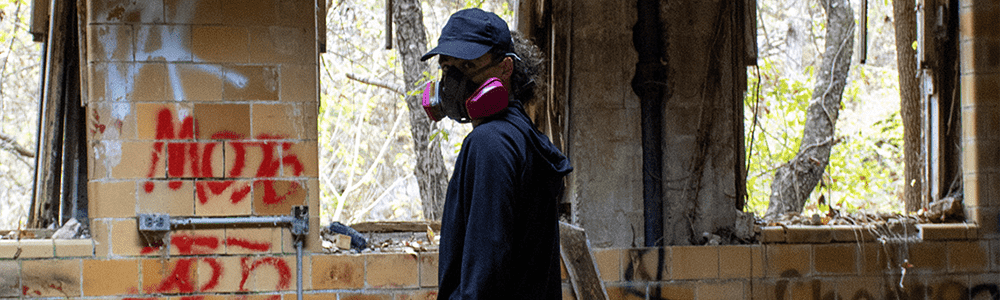
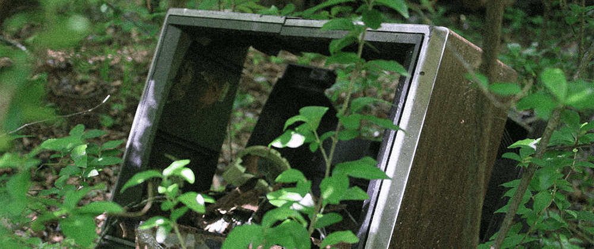

# Welcome!

Hiya, I'm Kai (they/them)!

I'm a recent computer science grad and all-around nerd. I enjoy working with the C family of languages, with C# being my favorite. When I'm not working, I'm practicing reverse engineering by working on old video games (particularly PS1 games). I also enjoy documenting the proprietary file formats that said old games use and writing tools for the particularly interesting ones. You can read about those endeavors over at the "Blog" tab on top of this page!

Aside from software development, I am an amateur photographer, coin collector, archivist, genealogist, explorer, and so much more (can you tell I get hooked on things easily?). The overarching theme encompassing a lot of my interests is a desire to capture and document things that are obscure, forgotten, or otherwise lost. (I blog about those things too!)

Below is a list of places you can find me. If you don't see the link you're looking for, try looking for me as ``resistiv`` or ``ResistivKai`` on your site of choice.

* [Bluesky](https://bsky.app/profile/resistiv.xyz) ``@resistiv.xyz``, my main social media site nowadays.
* [Tumblr](https://klnesmith.tumblr.com/) ``@klnesmith``, where I post my photography.
* [Twitch](https://www.twitch.tv/resistivkai) ``ResistivKai``, where I sometimes stream games with friends.

If you enjoy what I make and would like to support me, you can drop me a donation over on [my Ko-fi](https://ko-fi.com/resistiv)! 

My favicon was created by [@kingjaspy](https://twitter.com/kingjaspy) over on Twitter!

\- Kai :)

