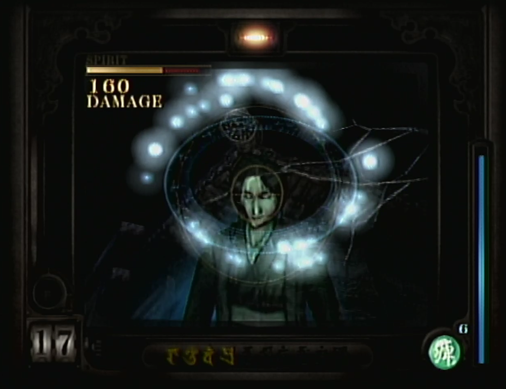
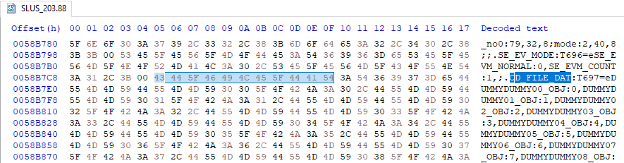
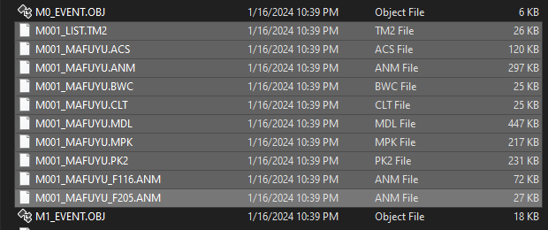

+++
date = '2024-01-17T00:49:30-0600'
draft = true
title = "Fatal Frame's IMG_HD.BIN and IMG_BD.BIN"
tags = ["fileformats", "ps2"]
summary = "Taking a closer look into Fatal Frame's storage format and finding file names where they don't exist. "
+++

Back in early 2020, just as the COVID-19 pandemic was taking its hold on the world, I picked up a copy of _Fatal Frame_ for the PlayStation 2. As I do with nearly every new game I get, I played through it for a while (even streaming it in this case) and eventually got curious as to how its assets are stored. In fact, I even made a Twitter thread (albeit chaotic and unprofessional) diving into my method for deciphering the format[^1]; this post should serve as a much better description of the process of reversing the format.

{: w="400" .left}

_Fatal Frame_ is a survival-horror game for the PlayStation 2, originally released in Japan in 2001 as _零～ｚｅｒｏ～_ and later released in North America and Europe as _Fatal Frame_ and _Project Zero_, respectively.

Without delving into the story, the game focuses on tense exploration of an abandoned and haunted Japanese mansion -- quite frankly, it builds atmosphere phenomenally through its use of tight spaces and interesting camera angles. Spirits will try to attack you throughout the mansion grounds, and they can only be defeated through use of the Camera Obscura, a unique camera which allows the player to see, damage, and exorcise the ghosts. It is very much worth a playthrough if you haven't given it a try!

## Basic Format

The top-level medium for asset storage in Fatal Frame manifests itself as the ``IMG_HD.BIN`` and ``IMG_BD.BIN`` files (being header and body files, respectively). Together, they form an incredibly barebones archive containing all of the game's assets. All values are **little-endian**.

### IMG_HD.BIN

The header file, ``IMG_HD.BIN``, contains an unspecified number of offset-length pairs. The offset value is a 32-bit unsigned integer which represents the disc sector a file entry starts at within the body file. That is, to get the "true" offset within the body: multiply the offset value by 2048 bytes (the sector length of a DVD). The length is a 32-bit unsigned integer, simply representing the length of the file entry.

In more concise terms, each pair looks like:

| Data Type | Description                           |
|:----------|:--------------------------------------|
| uint32    | The sector offset of this file entry. |
| uint32    | The length of this file entry.        |

Such a file can be processed by simply reading each pair until the end of the file. Alternatively, one can get the length in bytes of the file, divide by the size of a pair (8 bytes), and use that value to exactly bound the amount of pair reads needed.

### IMG_BD.BIN

The body file, ``IMG_BD.BIN``, contains all of the raw assets (no compression, no encryption, no mess!) padded by null/zero bytes between sector boundaries. Pretty straightforward, just jump to the desired offset from the header file and read the specified length of bytes.

Each file entry looks like:

| Data Type     | Description                                 |
|:--------------|:--------------------------------------------|
| uint8[``n``]  | All ``n`` bytes of data of this file entry. |
| uint8[``z``]  | Some ``z`` bytes of padding null values, where ``z`` is ``n modulo 2048``. |

## File Names

While the basic format is perfectly functional when it comes to use by the game itself, there's a distinct lack of file names which would significantly help with sorting and identifying the extracted files. So, where can they be found?

The format does not support names, but lucky for us, there is a large amount of debug information and are many symbols left within the game's executable. The name of the executable varies by region, but will generally take the form ``SXXX_NNN.NN`` where ``X`` is an alphabetic character and ``N`` is a numeric digit. First noted by user mariokart64n in a XeNTaX (R.I.P.) thread[^2], all of the file names (or some sort of naming) exist within the executable, presumably as debug symbols for each entry of an enum type named ``CD_FILE_DAT``.

_The first occurrence of "CD\_FILE\_DAT" within the North American Fatal Frame executable, SLUS_203.88, followed by the full file name list._

So, the complete list of file names can be found by finding the first occurrence of the string ``CD_FILE_DAT`` within the game's executable (other occurrences exist later in the executable, but they are followed by a truncated file name list). The enum name will be something like ``CD_FILE_DAT:T<some number>=e``, followed by a list of comma-separated (``,``) file names with the format ``<file name>:<file index>``. The list is terminated by a semicolon (``;``).  Additionally, it seems that the list is broken into separate strings with a backslash (``\``) and null byte once it reaches a certain length. Importantly, none of the file names have proper extensions; they are all alphanumeric with underscores and no periods; this can be resolved by replacing the last underscore of each file name with a period, which seems to yield accurate results.

Once you've read and parsed the executable, there should be an equal amount of entries and names. They are indexed the same, so the names can simply be used when writing out files at extraction time. Not so bad after all!

## Directory Names

Interestingly, mariokart64n also makes mention of a directory system that is "indexed a bit different", but I couldn't find anything aside from the file names. It's entirely possible that the string before the first underscore in a file name denotes a file's parent directory, as there are lots of files with repeated prefixes. However, there are also very many cases that would result in single files within single folders, so I'm not 100% certain. In this case, I think the implementation is best left to the individual developer, as there is no true way of deriving this information -- at least that I've seen thus far -- from the given enum names.

## Conclusion

Before Fatal Frame, I'd seen another game which takes a similar approach of using an enum to index a packed archive file, that being Beatmania for the PS1. However, Fatal Frame was the first that I had seen to include the enum's member names in the executable. So, it seems that a stroke of luck (or perhaps a stroke of oversight when it came to excluding debug symbols) is what preserved these file names, which makes extraction and organization much easier for us now!

I wanted to also note that the files contained within this main format have their own unique archive formats (namely PK2), but I think I'll address those in a separate post later down the line.

Thanks for reading, I hope you got something useful out of this post!

\- Kai

[^1]: [My original Fatal Frame Twitter thread](https://twitter.com/resistivkai/status/1242556929123155975)
[^2]: [Fatal Frame Character Models XeNTaX thread (Wayback Machine capture)](https://web.archive.org/web/20231014043025/https://forum.xentax.com/viewtopic.php?t=2774&start=15)
